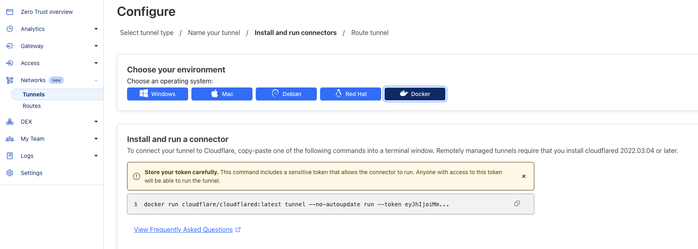

# [Ghost blog](https://github.com/TryGhost/Ghost) Docker setup on Raspberry Pi 

Setup Raspberry Pi to run Ghost blog platform and be reachable from outside the local network without opening router ports
using Cloudflare tunnel for free!

### Flash Raspberry Pi image 64bit into sd card
Use recommended Raspberry Pi Imager https://www.raspberrypi.com/software/

### Install Docker on 64bit Raspberry Pi 
https://docs.docker.com/engine/install/debian/

```bash
# Add Docker's official GPG key:
sudo apt-get update
sudo apt-get install ca-certificates curl
sudo install -m 0755 -d /etc/apt/keyrings
sudo curl -fsSL https://download.docker.com/linux/debian/gpg -o /etc/apt/keyrings/docker.asc
sudo chmod a+r /etc/apt/keyrings/docker.asc

# Add the repository to Apt sources:
echo \
  "deb [arch=$(dpkg --print-architecture) signed-by=/etc/apt/keyrings/docker.asc] https://download.docker.com/linux/debian \
  $(. /etc/os-release && echo "$VERSION_CODENAME") stable" | \
  sudo tee /etc/apt/sources.list.d/docker.list > /dev/null
sudo apt-get update

# Install docker
sudo apt-get install docker-ce docker-ce-cli containerd.io docker-buildx-plugin docker-compose-plugin
sudo docker run hello-world
```

### Install portainer (for easy container's management)
https://docs.portainer.io/start/install-ce/server/docker/linux
```bash
docker volume create portainer_data
docker run -d -p 8000:8000 -p 9443:9443 --name portainer --restart=always -v /var/run/docker.sock:/var/run/docker.sock -v portainer_data:/data portainer/portainer-ce:latest
```

### Ghost Docker image (run from portainer stack builder)
```yaml
version: '3.1'

services:

  ghost:
    image: ghost:5
    restart: always
    ports:
      - 8090:2368
    environment:
      # keep https! Ghost won't load images if server is served via https but this url parameter set to http
      url: https://your-blog.co.uk
    
      # see https://ghost.org/docs/config/#configuration-options
      database__client: mysql
      database__connection__host: db
      database__connection__user: root
      # Obviously change to something else
      database__connection__password: gsttHRAhaf5546
      database__connection__database: ghost
      
      # contrary to the default mentioned in the linked documentation, this image defaults to NODE_ENV=production (so development mode needs to be explicitly specified if desired)
      #NODE_ENV: development
    volumes:
      - ghost:/var/lib/ghost/content

  db:
    image: mysql:8
    restart: always
    environment:
      # has to match database__connection__password
      MYSQL_ROOT_PASSWORD: gsttHRAhaf5546
    volumes:
      - db:/var/lib/mysql

volumes:
  ghost:
  db:
 ```

### Ghost theme
https://ghost.org/themes/liebling v2.1.7 + css fixes [code_injection_footer.html](code_injection_footer.html)

### Useful commands
```bash
# ssh into Raspberry Pi
ssh gabe@192.168.1.175

# list running docker containers
sudo docker ps --no-trunc

# get inside running container
sudo docker exec -it e3b05925e21b /bin/bash

# ghost won't let you run anything with sudo privileges. Change to node 
su node

# copy files from Docker container into Raspberry Pi (run command from Raspberry Pi)
sudo docker cp e3b05925e21b:/var/lib/ghost/content ./ghost-content

# copy files from Raspberry Pi to local machine 
scp -r gabe@192.168.1.175:/home/gabe/ghost-content ./ghost-content-files

# install nano (ghost image doesn't have any text editors by default)
apt-get update
apt-get install nano
```

### Setup Cloudflare tunnel
1. Link your domain to Cloudflare. This will require to change DNS Nameservers at your Domain provider. Just follow Cloudflare instructions
2. Create Cloudflare tunnel using docker image **Cloudflare -> Zero Trust -> Networks -> Tunnels**


3. Copy Cloudflare Docker container command
    ```bash
    docker run cloudflare/cloudflared:latest tunnel --no-autoupdate run --token eyJhIjoiMmI5yourlongasstokenxxxxxxxxxxx
    ```

4. In Portainer create new **container** with 
    ```text
    Docker image `cloudflare/cloudflared:latest` 
    CMD `tunnel --no-autoupdate run --token eyJhIjoiMmI5yourlongasstokenxxxxxxxxxxx`
    RESTART POLICIES `Always`
    ```

5. Once container is running, comeback to Cloudflare and check if Connector is found. Continue instructions 


### Known issues
ghost-cli does not work properly. Does not detect already running instances. Cannot start or restart instances 
due to missing dependencies. Cannot run backup command (because does not see any running Ghost instances)

### Todo
[] Ghost platform export/backup system is garbage. It does not export images. Find proper solution 
